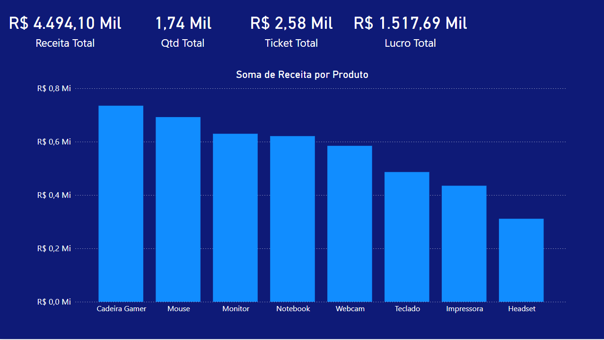
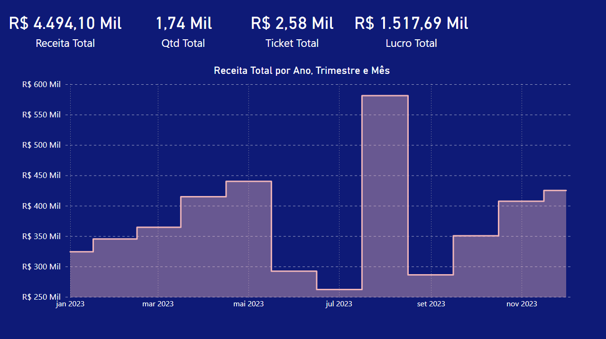
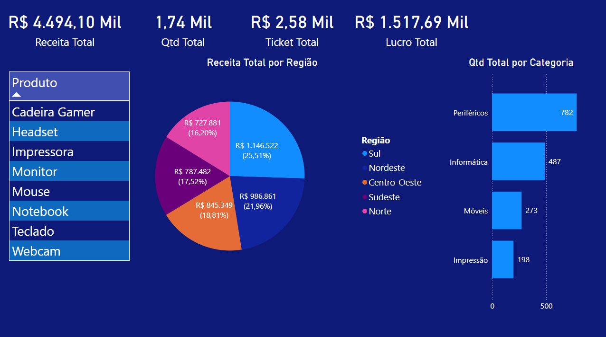
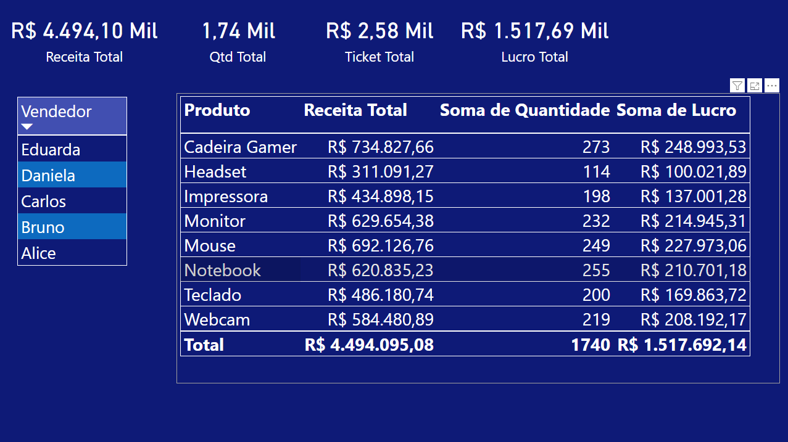

# dashboard-vendas-powerbi


# 📊 Dashboard de Vendas - Power BI

Este projeto tem como objetivo analisar dados fictícios de vendas utilizando o **Power BI Desktop**, com foco em visualizações interativas e indicadores comerciais que auxiliam na tomada de decisões estratégicas.

---

## 🎯 Objetivos do Projeto

- Analisar receita, lucro e ticket médio ao longo do ano.
- Avaliar desempenho por **produto**, **categoria**, **vendedor** e **região**.
- Fornecer uma interface clara para filtragem e extração de insights.

---

## 🛠️ Ferramentas Utilizadas

- Power BI Desktop
- Excel (para base de dados)
- DAX (para criação de medidas)
- Gráficos e segmentações interativas

---

## 📈 Visões Criadas

### Página 1 - Receita por Produto
- Indicadores: Receita Total, Quantidade Total, Ticket Médio, Lucro Total
- Gráfico de colunas com receita por produto

### Página 2 - Evolução Temporal
- Gráfico de área mostrando receita total por mês
- Eixo hierárquico com ano, trimestre e mês

### Página 3 - Região e Categoria
- Gráfico de pizza com Receita Total por Região
- Gráfico de barras com Quantidade por Categoria
- Segmentação por Produto

### Página 4 - Visão Geral por Vendedor
- Tabela com receita, quantidade e lucro por produto
- Segmentação por vendedor

---

## 🔍 Métricas Criadas (DAX)

```DAX
Receita Total = SUM(Vendas[Receita])
Lucro Total = SUM(Vendas[Lucro])
Qtd Total = SUM(Vendas[Quantidade])
Ticket Total = DIVIDE([Receita Total], [Qtd Total], 0)
```

---

## 📂 Estrutura dos Dados

A base foi gerada artificialmente com os seguintes campos:

- `Data`
- `Produto`, `Categoria`
- `Vendedor`, `Região`
- `Quantidade`, `Preço Unitário`
- `Receita`, `Custo`, `Lucro`

---

## 🖼️ Demonstração

### Página 1  


### Página 2  


### Página 3  


### Página 4  


---

## 🧠 O que Aprendi

- Modelagem de dados no Power BI
- Criação de medidas com DAX
- Uso de segmentações para filtros dinâmicos
- Construção de dashboards interativos

---

## 🚀 Próximos Passos

- Adicionar comparação entre anos
- Implementar projeções futuras com base nos dados
- Integrar com fontes externas (Google Sheets, banco SQL)

---

## 📎 Arquivos incluídos

- `Dashboard_Vendas_PowerBI.pbix` – Arquivo do Power BI
- `Dashboard_Vendas_PowerBI.xlsx` – Base de dados
- Imagens das páginas do dashboard

